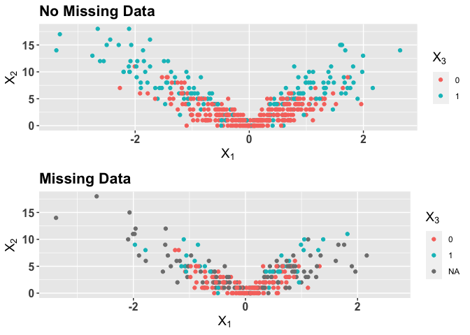
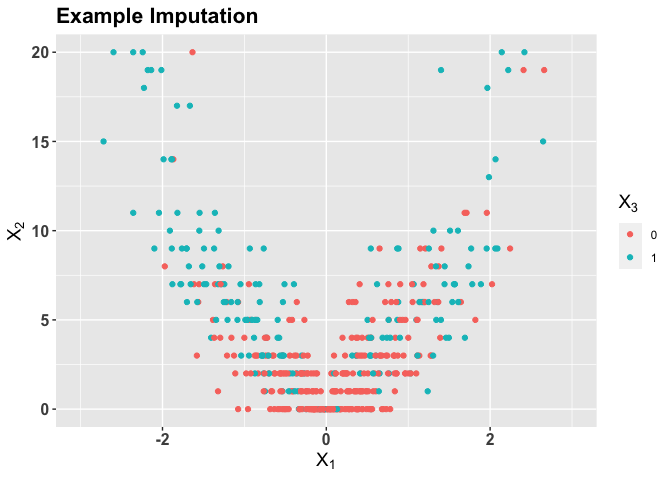
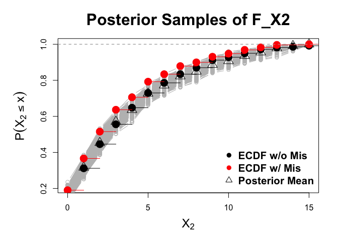

The Gaussian Mixture Copula for Inference with Missing Data
================
Joe Feldman
7/10/2022

# Installation

``` r
# library(devtools)
# remotes::install_github('jfeldman396/GMCImpute')

library(GMCImpute)
```

# Background: Missing Data

Missing data is commonplace in survey and fused data sets, necessitating
sophisticated methods for dealing with missingness when deriving
inference. First, these data sets may be comprised of mixed data types,
such as continuous, count, and nominal variables. Second, the missing
data may bias certain properties of the data set. As a result, a
complete case analysis, where the analyst drops any observations with
missing values, would lead to misleading insights on the data.

Consider the following simulated example of a continuous variable
*X*<sub>1</sub>, a count variable *X*<sub>2</sub>, and a binary variable
*X*<sub>3</sub>, where missing values in *X*<sub>2</sub> and
*X*<sub>3</sub> are correlated to large values of *X*<sub>1</sub> in
absolute value.

``` r
set.seed(47)
num= 500
X1<-rnorm(num)
X2<- rpois(num,5*abs(X1))
X3<- as.factor(rbernoulli(num,pnorm(-.5+scale(X2))))
X<- data.frame(X1,X2,X3)

R = t(sapply(1:num, function(x)rbernoulli(2, p = pnorm(-.5 + .5*abs(X1[x]))))) # missingness mechanism
X_noMis = X
X[which(R[,1] == T),2] = NA
X[which(R[,2] == T),3] = NA
```

We can visualize bias that the mechanism creates in
*X*<sub>2</sub>, *X*<sub>3</sub> with the following plots.

    ## Warning: Removed 211 rows containing missing values (geom_point).

<!-- -->

As you can see, both margins are affected. We show a comparison of the
empirical cdfs of *X*<sub>2</sub> before and after inputting missing
values, while the incidence of positive indicators is greatly reduced
for *X*<sub>3</sub>

<!-- -->

# The Gaussian Mixture Copula with Margin Adjustment

The function `GMC_Impute` allows users to fit a Gaussian mixture copula
to data comprised of unordered categorical, binary, count and continuous
data types with missing values. This is done through utilization of the
extended rank-probit likelihood, which enables copula estimation on the
aforementioned data types. The function then produces a user specified
number of multiple imputations.

Key to gaussian mixture copula are the marginal distributions of each
variable in the data, as latent variables, modeled with finite mixture
are linked to the observed scale using the inverse marginal distribution
function. Previous work estimates these margins empirically, which is
problematic given that the missing data clearly biases these estimates.
The margin adjustment corrects these biases, yielding proper inference
with missing data.

# Fitting the model

To use the function, the user can specify a number of properties of the
model:

-   `nImp`: The number of imputations to create
-   `H`: The upper bound for the number of clusters in the truncated DP
    mixture
-   `k.star`: The dimension of the latent factors, defult is
    `ceiling(0.7*p)`
-   `nsamp`: number of interations in the MCMC
-   `burn`: burn-in before posterior samples are saved
-   `hyperparams`:
    -   `delta`: to the precision of the prior covariance. This
        parameter has been the most influential in the discovery of new
        clusters. Lower to find more clusters. Default value is 10
    -   `k.star`: change to increase or decrease dimension of latent
        factors
    -   `a_alpha`
    -   `b_alpha`
    -   `nu_mix`
    -   `kappa_0`
    -   `nu`
    -   `a1`
    -   `a2`
    -   `a.sigma`
    -   `b.sigma`
    -   `D_0`: k.star dimensional identity

Default values are included in the function documentation, but we
recommend altering *δ* to improve model fit. The function is called
below:

``` r
hyperparams = list(delta = 10,
                   k.star = 2,
                   plugin.threshold = 100,
                   a_alpha = 1,
                   b_alpha = 3,
                   nu_mix = 4,
                   kappa_0 = .001,
                   nu = 3,
                   a1 = 2,
                   a2 = 3,
                   a.sigma = 1,
                   b.sigma = .3,
                   D_0 = diag(1,2))
mcmc<-GMC.mcmc(Data = X, nImp = 5,hyperparams = hyperparams, burn = 1500,nsamp = 2000, seed = 47)
```

`GMC_Impute` returns `nImp` imputations, as well as posterior samples of
Copula parameters which may be used for simulation of posterior
predictive data sets or posterior inference. See documentation for
format.

# Plotting Results

## Visualizing Imputations:

    ## Warning: Removed 1 rows containing missing values (geom_point).

<!-- -->

## Plotting posterior samples from the margin adjustment

We can plot posterior samples of the marginal distribution of
*X*<sub>2</sub>, as well as point-wise posterior means:

``` r
par(mar = c(5,6,4,2))
range = range(mcmc$Support[[3]][1,(2:dim(mcmc$Support[[3]])[2])]) # get support
quantiles = mcmc$Quantiles[[3]] #get quantiles
plot(range[1]:range[2],quantiles[1,2:(range[2]+2)],
    col = "gray",
    type = 'b',
     xlab = expression(X[2]),
     ylab = expression(P(X[2] <= x)),
     main = "Posterior Samples of F_X2",
     cex.lab = 1.5,
     cex.main = 2)
sapply(2:500,function(x)points(range[1]:range[2],quantiles[x,2:(range[2]+2)], col ='gray', type = 'b'))
lines(ecdf(X_noMis$X2), cex = 2)
points(range[1]:range[2],colMeans(quantiles[2:500,2:(range[2]+2)]),pch =2, cex = 2)
lines(ecdf(X$X2), col = 2, cex = 2)
  legend("bottomright",c("ECDF w/o Mis","ECDF w/ Mis","Posterior Mean"), pch = c(16,16,2),col = c(1,2,1),bty = 'n', cex = 1.3, text.font = 2)
```

<!-- -->

# Simulating Predictive Data Sets

Finally, we can use the posterior samples to generative a fixed quantity
of posterior predictive data sets for checks and inference. This is done
by using the returned samples from GMC.mcmc. Here we create two
predictive data sets.

``` r
#get predictive data sets
pred<- get_predictive_Y(mcmc, # GMC mcmc object
                        nobs = dim(X)[1], # number of observations in predictive data set; we use n = dim(X)[1]
                        nsets = 2, # number of predictive data sets to create
                        seed = 10)

#plot results
grid.arrange(ggplot(pred$Y_pred[[1]], aes(x = X1, y = X2, color = X3))+
               geom_point() +
               ggtitle("Posterior Predictive Data Set #1")+
               xlab(expression(X[1]))+
               ylab(expression(X[2]))+
               scale_color_discrete(name = expression(X[3]),
                                    labels = c(0,1))+
               theme(axis.text = element_text(size = 12, face = "bold"),
                     axis.title = element_text(size = 14, face = "bold"),
                     legend.title= element_text(size = 14, face = "bold"),
                     plot.title = element_text(size = 16, face = "bold")),

ggplot(pred$Y_pred[[2]], aes(x = X1, y = X2, color = X3))+
               geom_point() +
               ggtitle("Posterior Predictive Data Set #2")+
               xlab(expression(X[1]))+
               ylab(expression(X[2]))+
               scale_color_discrete(name = expression(X[3]),
                                    labels = c(0,1))+
               theme(axis.text = element_text(size = 12, face = "bold"),
                     axis.title = element_text(size = 14, face = "bold"),
                     legend.title= element_text(size = 14, face = "bold"),
                     plot.title = element_text(size = 16, face = "bold")), ncol = 1)
```

<!-- -->
