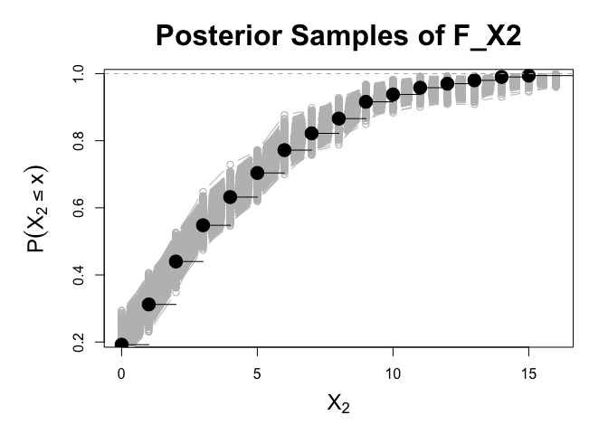
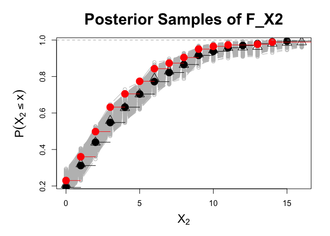
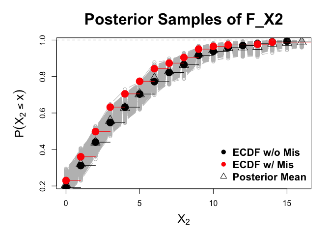
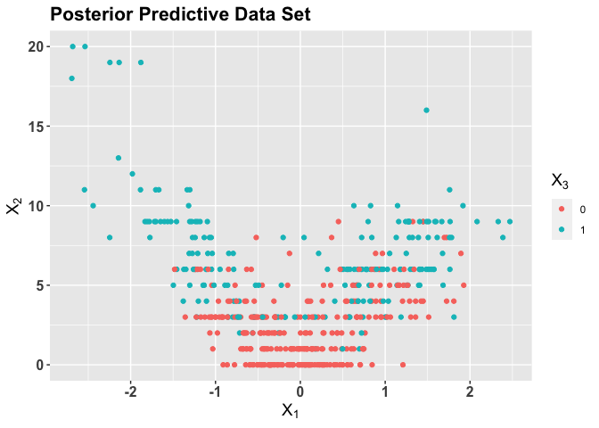

The Gaussian Mixture Copula for Inference with Missing Data
================
Joe Feldman
7/10/2022

# Installation

``` r
# library(devtools)
# remotes::install_github('jfeldman396/GMCImpute')

library(GMCImpute)
```

    ## Warning: replacing previous import 'data.table::last' by 'dplyr::last' when
    ## loading 'GMCImpute'

    ## Warning: replacing previous import 'data.table::first' by 'dplyr::first' when
    ## loading 'GMCImpute'

    ## Warning: replacing previous import 'MASS::select' by 'dplyr::select' when
    ## loading 'GMCImpute'

    ## Warning: replacing previous import 'data.table::between' by 'dplyr::between'
    ## when loading 'GMCImpute'

    ## Warning: replacing previous import 'LaplacesDemon::dmvt' by 'mvtnorm::dmvt' when
    ## loading 'GMCImpute'

    ## Warning: replacing previous import 'LaplacesDemon::rmvt' by 'mvtnorm::rmvt' when
    ## loading 'GMCImpute'

    ## Warning: replacing previous import 'LaplacesDemon::partial' by 'purrr::partial'
    ## when loading 'GMCImpute'

    ## Warning: replacing previous import 'data.table::transpose' by 'purrr::transpose'
    ## when loading 'GMCImpute'

# Background: Missing Data

Missing data is commonplace in survey and fused data sets, necessitating
sophisticated methods for dealing with missingness when deriving
inference. First, these data sets may be comprised of mixed data types,
such as continuous, count, and nominal variables. Second, the missing
data may bias certain properties of the data set. As a result, a
complete case analysis, where the analyst drops any observations with
missing values, would lead to misleading insights on the data.

Consider the following simulated example of a continuous variable
*X*<sub>1</sub>, a count variable *X*<sub>2</sub>, and a binary variable
*X*<sub>3</sub> simulated under the following dependence structure:

$$ X\_{1} \\sim N(0,1)\\\\
X\_{2} \\mid X\_{1} = x\_{1} \\sim Poisson(5 \* \\lvert x\_{1} \\rvert) \\\\
X\_{3} \\mid X\_{1} = x\_{1}, X\_{2} = x\_{2} \\sim Bernoulli(scale(x\_{2}))$$

``` r
num= 500
X1<-rnorm(num)
X2<- rpois(num,5*abs(X1))
X3<- as.factor(rbernoulli(num,pnorm(-.5+scale(X2))))
X<- data.frame(X1,X2,X3)
```

Next, we introduce a missingness mechanism **R** that creates bias
across the data set by correlating missing values in *X*<sub>2</sub> and
*X*<sub>3</sub> with *X*<sub>1</sub>. Specifically, if
*R*<sub>*i**j*</sub> = 1, then
*X*<sub>*i**j*</sub> = *m**i**s**s**i**n**g*. We use the following
missingness mechanism in this example:

*P*(*R*<sub>*i**j*</sub> = 1 ∣ *X*<sub>1</sub> = *x*<sub>1</sub>) = *B**e**r**n**o**u**l**l**i*( − 0.5 + 0.5 \* *Φ*(*x*<sub>1</sub>))
Where *Φ* is the standard normal cdf.

``` r
R = t(sapply(1:num, function(x)rbernoulli(2, p = pnorm(-.5 + .5*abs(X1[x]))))) 
X_noMis = X
X[which(R[,1] == T),2] = NA
X[which(R[,2] == T),3] = NA
```

We can visualize bias that the mechanism creates in
*X*<sub>2</sub>, *X*<sub>3</sub> with the following plots. **R** removes
values of *X*<sub>2</sub> and *X*<sub>3</sub> for large values of
*X*<sub>1</sub> in absolute value.

    ## Warning: Removed 239 rows containing missing values (geom_point).

<!-- --> As a result,
both margins are affected. We show a comparison of the empirical cdfs of
*X*<sub>2</sub> before and after inputting missing values, while the
incidence of positive indicators is greatly reduced for *X*<sub>3</sub>

<!-- -->

# The Gaussian Mixture Copula with Margin Adjustment

The function `GMC_Impute` allows users to fit a Gaussian mixture copula
to data comprised of unordered categorical, binary, count and continuous
data types with missing values. This is done through utilization of the
, which enables copula estimation on the aforementioned data types. The
function then produces a user specified number of multiple imputations.

The model is given by
$$z\_{i} \\sim N(\\Lambda \\eta\_{i}, \\Sigma),\\ \\eta\_{i} \\sim \\sum\_{h=1}^{H^{\*}\\leq H} \\pi\_{h}N(\\mu\_{h},\\Delta\_{h})\\\\
\\Sigma \\sim Gamma(a\_{\\sigma},b\_{\\sigma}),\\lambda\_{jh} \\sim N(0, \\phi\_{jh}^{-1}\\tau\_{h}^{-1})\\\\
\\phi\_{jh} \\sim Gamma(\\nu/2,\\nu/2), \\tau\_{h} = \\prod\_{l=1}^{h}\\delta\_{h}^{\\tau} \\\\
\\text{with} \\ \\delta^{\\tau}\_{1} \\sim Gamma(a\_{1},1) \\ \\text{and} \\ \\delta^{\\tau}\_{l} \\sim Gamma(a\_{2},1), \\ l\\geq 2, \\ a\_{2} \\geq 1$$

For the mixing weights, we use the truncated dirichlet process prior,
which specifies an upper bound for the number of clusters and allows the
data to inform which *H*<sup>\*</sup> get populated

$$\\pi\_{h} = V\_{h}\\prod\_{l&lt;h} (1-V\_{l}),\\  V\_{h}\\sim Beta(1, \\alpha\_{\\pi})\\\\
        \\alpha\_{\\pi} \\sim Gamma(a\_{\\alpha}, b\_{\\alpha})$$

For the prior on *η*, we use a Normal-Inverse Wishart:
(**μ**<sub>**h**</sub>**,** **Δ**<sub>**h**</sub>) ∼ *N**o**r**m**a**l* − *I**n**v**e**r**s**e**W**i**s**h**a**r**t*(**μ**<sub>**0**</sub>, *δ*<sup>2</sup> \* **I**<sub>**k**</sub>, *κ*<sub>0</sub>, *ν*<sub>*m**i**x*</sub>)

Key to gaussian mixture copula are the marginal distributions of each
variable in the data, as latent variables, modeled with finite mixture
are linked to the observed scale using the inverse marginal distribution
function. Previous work estimates these margins empirically, which is
problematic given that the missing data clearly biases these estimates.
The margin adjustment corrects these biases, yielding proper inference
with missing data.

# Fitting the model

To use the function, the user can specify a number of properties of the
model:

-   `nImp`: The number of imputations to create
-   `H`: The upper bound for the number of clusters in the truncated DP
    mixture
-   `k.star`: The dimension of the latent factors, defult is
    `ceiling(0.7*p)`
-   `nsamp`: number of interations in the MCMC
-   `burn`: burn-in before posterior samples are saved
-   `hyperparams`:
    -   `delta`: to the precision of the prior covariance. This
        parameter has been the most influential in the discovery of new
        clusters. Lower to find more clusters. Default value is 10
    -   `k.star`: change to increase or decrease dimension of latent
        factors
    -   `a_alpha`
    -   `b_alpha`
    -   `nu_mix`
    -   `kappa_0`
    -   `nu`
    -   `a1`
    -   `a2`
    -   `a.sigma`
    -   `b.sigma`
    -   `D_0`: k.star dimensional identity

Default values are included in the function documentation, but we
recommend altering *δ* to improve model fit. The function is called
below:

``` r
hyperparams = list(delta = 10,
                   k.star = 2,
                   plugin.threshold = 100,
                   a_alpha = 1,
                   b_alpha = 3,
                   nu_mix = 4,
                   kappa_0 = .001,
                   nu = 3,
                   a1 = 2,
                   a2 = 3,
                   a.sigma = 1,
                   b.sigma = .3,
                   D_0 = diag(1,2))
imps<-GMC_Impute(Data = X, nImp = 5,hyperparams = hyperparams, burn = 5000,nsamp = 10000, seed = 47)
```

`GMC_Impute` returns `nImp` imputations, as well as posterior samples of
Copula parameters which may be used for simulation of posterior
predictive data sets or posterior inference. See documentation for
format.

# Plotting Results

## Visualizing Imputations:

    ## Warning: Removed 2 rows containing missing values (geom_point).

<!-- -->

## Plotting posterior samples from the margin adjustment

We can plot posterior samples of the marginal distribution of
*X*<sub>2</sub>, as well as point-wise posterior means:

``` r
  par(mar = c(5,6,4,2))
range = range(imps$Support[[3]][1,2:18]) # get support
quantiles = imps$Quantiles[[3]] #get quantiles
 plot(range[1]:range[2],quantiles[1,2:(range[2]+2)],
      col = "gray",
      type = 'b',
       xlab = expression(X[2]),
       ylab = expression(P(X[2] <= x)),
       main = "Posterior Samples of F_X2",
       cex.lab = 1.5,
       cex.main = 2)
```

<!-- -->

``` r
  sapply(2:5000,function(x)points(range[1]:range[2],quantiles[x,2:(range[2]+2)], col ='gray', type = 'b'))
```

<!-- -->

``` r
  lines(ecdf(X_noMis$X2), cex = 2)
```

<!-- -->

``` r
  points(range[1]:range[2],colMeans(quantiles[2:5000,2:(range[2]+2)]),pch =2, cex = 2)
```

<!-- -->

``` r
  lines(ecdf(X$X2), col = 2, cex = 2)
```

<!-- -->

``` r
    legend("bottomright",c("ECDF w/o Mis","ECDF w/ Mis","Posterior Mean"), pch = c(16,16,2),col = c(1,2,1),bty = 'n', cex = 1.3, text.font = 2)
```

<!-- -->

# Simulating Predictive Data Sets

Finally, we can use the posterior samples to generative posterior
predictive data sets for checks and inference. This is done by using the
returned samples from GMC\_Impute

``` r
#use the 2000th sample as an example

#GMC parameters
mu = lapply(1:25, function(x) return(imps$mus[[x]][2000,]))
alpha = rep(0,3)
Delta = lapply(1:25, function(x) return(imps$Deltas[[x]][2000,,]))
Lambda = imps$Lambdas[2000,,]
pi_h = imps$pis[2000,]
Sigma.diag= imps$Sigmas[2000,]
#column names and memberships
col_mem = imps$col_mem
cat_col_names = imps$cat_col_names
bin_col_names = imps$bin_col_names
count_col_names = imps$count_col_names
cont_col_names = imps$con_col_names
H = 25
Y = imps$dat
z = imps$zs[2000,]
Fns = vector('list', 3) #format marginal distributions
for(i in 1:3){
  support = imps$Support[[i]][2000,]
  qs = imps$Quantiles[[i]][2000,]
  Fj = cbind(support,rep(0,length(support)),qs)
  Fns[[i]] = Fj
  
}

Y = imps$dat #for 
H =25

pred<- get_predictive_Y(n = dim(Y)[1],
                          Lambda = Lambda,
                          mu = mu,
                          alpha = alpha,
                          Delta = Delta,
                          pi_h = pi_h,
                          Sigma.diag = Sigma.diag,
                          col_mem = col_mem,
                          cat_col_names = cat_col_names,
                          bin_col_names = bin_col_names, 
                          count_col_names = count_col_names,
                          cont_col_names = cont_col_names,
                          H = H,
                          Y = Y,
                          z = z,
                          Fns = Fns,
                          seed = 2)
```

<!-- -->
